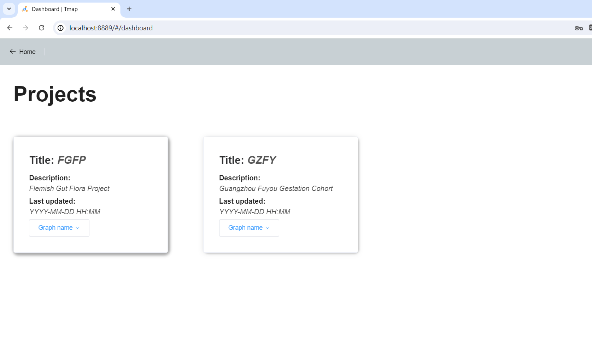

# 登录页（Home.vue）

​	

### 输入框：

用户名输入框，默认**admin**

密码输入框，密码：**0011**，

点击login登陆按钮，或者直接回车

### 背景画布：

使用<vue-particles>标签制作点线背景画布

黑色背景主题：

```js
this.$vuetify.theme.dark = true
```

### 输入框的函数：

**routerRedirect（）**判断是否输入用户名和密码，以及密码是否正确

如果密码正确后，将token存储到**localStorage**里，名为user，

并且跳转到首页**Dashboard.vue**

```js
this.$router.push('/dashboard')
```


# 首页（Dashboard.vue）



### 面板卡片：

两个数据源面板，展示数据信息

点击**graph name**，出现下拉框，选择数据集

左上角有一个Home返回按钮，点击回到登陆页面

黑色背景主题关闭：

```js
this.$vuetify.theme.dark = false
```


### 数据集函数：

选择数据集，触发函数**handleTextClick()**

获取选择的数据集名字graphName ：

```js
const graphName = event.target.innerText
```

把选到的graphName 存到**localStorage**里，

点击后，跳转到对应graphName 的示例页面**Examples.vue**，地址参数为选中的graphName 

```js
this.$router.push(`/project_id=${graphName}/Features`)
```

 goBack()函数：清除**localStorage**里的token，回到登陆页面，重新登陆


# 示例页面（**Examples.vue**）

### 框架布局：

示例页面承载菜单栏各个模块的框架布局，写入各个模块的共同组件

包含菜单栏、顶部导航条

### 菜单栏的函数：

点击菜单栏，展开一级目录，再次点击，跳转到相应模块，函数**handleSelect（）**

点击顶部导航条的Dashboard返回按钮，可以回到首页，重新选择数据集，函数**goBack()** 

返回按钮右边有一个汉堡按钮，点击可以折叠菜单栏，函数**menuCollapse()**


# 路由设置（router.js）

### 页面地址的写入：

如下面的登陆页地址

```js
routes: [
   {
      path: '/home',
      name: 'home',
      component: () => import('./views/Home.vue'),
      meta: { title: 'Home' }
    }
```

path设置地址参数，component设置文件位置

### 导航守卫：

函数**router.beforeEach(）**：导航守卫，判断是否有token，以及token是否正确，即是否在登陆页面登陆后跳转的，如果没有正确的token，则跳转到登陆页面重新登陆


# 数据存储（./store/index.js）

### vuex：

使用vuex的数据存储功能，进行数据跨网页传输

```js
new Vuex.Store({
  state: {
    isCollapse: false, // 初始化存的值
    users: JSON.parse(localStorage.getItem('users')) || {
      token: '',
      userName: ''
    }
  },
  mutations: {
    navCollapse(state) {
      state.isCollapse = !state.isCollapse
    }
  }
})
```

isCollapse:菜单栏折叠状态，navCollapse触发状态修改

users：登陆token


# Features模块（Features.vue）


Features模块是跳转到示例页，默认显示的第一个模块，也可以点击菜单栏里ranking，进行跳转

### 直方图：

#### top features组件：

筛选显示直方图前n位的柱子，可手动输入数字，或者点击按钮上下调整数字

##### **interval**：

绑定输入框的数字

表单数据interval，当数据变化时，触发监听事件

```js
watch: {
    interval: 'updateChart' 
  },
```

##### 函数**updateChart()**：

修改直方图的x轴的柱子数量的设置，数量为interval，最后更新图表

#### Reset组件：

top features组件的数字还原按钮，点击触发**ResetTop**函数，把输入框的数字interval恢复为初始值，即最大值

#### 搜索框组件：

点击搜索框，展开下拉框，滚动显示所有可选择变量，在搜索框输入关键字，显示所有包含关键字的变量，点击变量，联动直方图和网络图，显示对应变量，以及网络图中，与选中变量相连的其他节点的信息

```html
<div class="querySearch">
```

绑定函数**handleSelect**，调用该节点的点击事件

#### Cancel组件：

搜索框组件的变量清空，点击触发SearchCancel函数，清空搜索框数据同时，取消所有直方图和网络图的联动

#### 图例组件：

每个图例对应一个类别，每个类别包含有多个变量名，点击图例，直方图显示对应类别的柱子，柱子颜色与色块颜色一致

```html
<div class="button-container">
```

#####  all图例：

绑定函数**toggleBarsAll**：

点击后，恢复所有直方图的柱子，重置所有数据

##### 类别图例：

绑定函数**toggleBarsByCategory(category)**：

点击后，传入类别参数category，对于符合类别的柱子显示，过滤不符合的，横坐标轴的标签只显示第一个和最后一个标签

#### 直方图组件：

设置直方图的宽高

```html
<div id="chartBary" style="width: 58vw; height: 40vh"></div>
```

在option设置直方图的参数

```js
const option = {
      grid: {
        top: '15%'
      },
     ...
    }
```

dataZoom控制缩放模式，目前是滚动缩放和框选缩放，两种皆可用

导入x轴和y轴的数据，初始显示所有类别的柱子，按从大到小排序显示

对每个柱子点击，也会进行匹配筛选，显示该变量的柱子，以及在网络相连的其他节点的柱子，联动直方图和网络图，触发网络图节点的点击事件

```js
  this.chartBar.on('click', function (params) {
      const currentBar = params.name // 获取当前点击的柱子名称
      node.filter((d) => d.id === currentBar).dispatch('click')
    })
```


### 网络图svg：

##### 建立svg

```html
<svg id="viy"></svg>
```

##### d3.select获取svg

```js
let svg = d3.select('#viy')
let container = svg.append('g')
```

使用d3.select获取到这个svg，并增加一个名为g的画布

##### node数据和样式：

```js
 let node = container
      .append('g')
      .attr('class', 'nodes')
      .selectAll('g')
      .data(graph.nodes)
      .enter()
      .append('circle')
      .attr('id', function (d) {
        return d.id
      })
      .attr('r', function (d) {
        return d.degree * 2
      })
      .attr('fill', (d) => colorMap[variableToCategoryMap[d.id]])
      .style('stroke', '#caa455')
      .style('stroke-width', '1px')
      .style('stroke-linecap', 'round')
```

.data(graph.nodes)导入节点数据

.append('circle')设置形状为圆形

.attr('id', )导入节点的id

.attr('r',  )导入节点的半径

.attr('fill',)设置节点的颜色，使用函数**colorMap[variableToCategoryMap[d.id]]**，根据节点变量属于的种类，显示与类别对应的颜色

##### line数据和样式：

```js
 let link = container
      .append('g')
      .attr('class', 'links')
      .selectAll('line')
      .data(graph.links)
      .enter()
      .append('line')
      .attr('stroke', 'pink')
      .attr('stroke-width', function (d) {
        return d.value * 5
      })
```

 .data(graph.links)导入线的数据

.attr('stroke', 'pink')设置线的颜色

.attr('stroke-width', )设置线的宽度

##### d3.zoom定义缩放行为

```js
let zoom = d3.zoom().on('zoom', zooming)
```

在函数zooming中，设置鼠标滚动进行缩放，并且设置初始缩放比例

##### 直方图和网络图自适应大小变化

```js
 window.addEventListener('resize', this.resize)
```

绑定函数**resize**，监听窗口大小变化事件，设置直方图和网络图的宽高随浏览器窗口大小变化而变化

##### 节点标签鼠标悬浮显示

```js
node.on('mouseover', idFocus).on('mouseout', idUnFocus)
```

鼠标移入节点上方，绑定函数**idFocus**，右上方显示节点标签信息，

鼠标移出节点，绑定函数**idUnFocus**，清除标签信息

##### 力导向图设置

```js
let graphLayout = d3
      .forceSimulation(graph.nodes)
      .alphaMin(0.000001)
      .alphaDecay(0.0183)
      .velocityDecay(0.2)
      .force('charge', d3.forceManyBody().strength(-200))
      .force('center', d3.forceCenter(this.width / 2, this.height / 2))
      .force('x', d3.forceX())
      .force('y', d3.forceY())
      .force(
        'link',
        d3
          .forceLink(graph.links)
          .id(function (d) {
            return d.id
          })
          .distance(50)
          .strength(1)
      )
      .on('tick', ticked)
```

d3.forceSimulation 力导向图的数据设置，节点之间存在斥力以及线的拉力

.force('charge', )设置节点之间斥力的大小

.force('center', )设置网络图的中心位置

.force( 'link',)设置线的拉力的大小

.on('tick', ticked)绑定函数**ticked**，更新节点的每一刻的位置，提供xy坐标

##### d3.drag定义节点拖拽行为

```js
const drag = d3.drag().on('start', dragstarted).on('drag', dragged).on('end', dragended)
node.call(drag)
```

dragstarted表示拖拽前，dragged表示拖拽中，dragended表示拖拽后，

**在dragstarted中：**

 d3.event.sourceEvent.stopPropagation()表示节点停止移动

if (!d3.event.active) graphLayout.alphaTarget(0.3).restart()表示被拖动的节点，会出现晃动效果，0.3代表晃动效果的强度，

**在dragged中：**

d.fx = d3.event.x     d.fy = d3.event.y表示拖动节点的x、y坐标与鼠标的x、y坐标一致

**在dragended中：**

if (!d3.event.active) graphLayout.alphaTarget(0)

表示选中的节点的晃动效果为0

d.fx = null    d.fy = null

表示拖动节点的x、y坐标不再与鼠标的x、y坐标一致

（此处还绑定了一个效果，如果拖拽的是已点击选中的节点，拖拽结束后，会更新节点标签新的位置）

##### click定义节点点击事件

```js
 node.on('click', clickSelect)
```

鼠标点击网络图上面的节点后，触发绑定函数**clickSelect**

```js
if (lastClickedBar === currentBar) {}else{}
```

首先进行条件判断，如果是第一次点击，则出现节点选中状态，并且与选中节点相邻的也会高亮，同时联动直方图显示数据

当第二次点击，如果点击的节点不是同一个节点，则会显示新的节点选中，其他相邻节点高亮也会改变

如果对同一个节点点击两次，则会恢复所有节点高亮，也不会有节点选中状态，触发函数**toggleBarsAll**，即还原所有节点数据和样式

##### 节点选中后的函数：

```js
node.style('opacity', )
```

设置节点的透明度

```js
node.filter((d) => neigh(index, d.index))
```

筛选出与选中节点相邻的节点，保证筛选出的节点高亮，其他节点透明度降低

```js
container
              .append('text')
              .text(d.id)
              .attr('x', d.x + 8)
              .attr('y', d.y - 10)
              .style('font-family', 'Arial')
              .style('font-size', 13)
              .style('pointer-events', 'none')
```

给高亮节点显示变量名称的标签

```js
node.style('stroke', (d) => (d.id === currentBar ? 'black' : '#caa455'))
node.style('stroke-width', (d) => (d.id === currentBar ? '2px' : '1px'))
```

设置选中节点的边框颜色和宽度

直方图联动：

对直方图的横坐标数据xAxis[0].data进行筛选

```js
option.xAxis[0].data = option.xAxis[0].data.filter((_, index) => {
            return _this.linkingNode.includes(index)
          })
```

对直方图的纵坐标数据series[0].data进行筛选

```js
option.series[0].data = option.series[0].data.filter((_, index) => {
            return _this.linkingNode.includes(index)
          })
```

只显示选中节点以及与之相连的变量的柱子，以及横坐标显示所有变量名称


### 节点信息面板：

##### 节点信息面板结构

```html
<div class="summarycard">
```


##### 选中节点后的面板参数：

**Selected node**：点击选中的节点的变量名

**Enriched SAFE score**:点击选中的节点的值

**number of enriched nodes on TDA network**:网络图里高亮的节点数量，即选中节点以及相连节点的数量

**number of enriched samples on TDA network**:网络图里高亮的节点中，共有几个类别

**Co-enrichment neighbors**:所有与选中节点相连的节点的变量名


##### 跳转forebased的链接：

**explore on TDA network**：绑定函数**exploreMap**，点击跳转到forebased页面，并且把选中的变量存到localStorage存储，名为paramsMap，从forebased回到features页面后，还能保留节点选中的状态


# Forebased模块（Forebased.vue）


分为左侧控件、主体部分svg画布、面板和直方图

#### 控件部分：

使用了elementui插件和阿里iconfont的icon图标，参考https://element.eleme.cn/#/zh-CN/component/button，https://www.iconfont.cn/search/index?searchType=icon&page=1&fromCollection=-1

##### 1.全屏控件

两个按钮样式，分布是全屏按钮和取消全屏按钮

全屏绑定函数**requestFullscreen**

取消全屏绑定函数 **exitFullScreen**

鼠标移入按钮上方会产生文字提示，使用以下代码实现

```html
<el-tooltip placement="right" :delay="{ show: 500, hide: 1000 }" :hide-after="2000" content="全屏"></el-tooltip>
```

##### 2.暂停控件

两个按钮样式，分布是暂停按钮和开始按钮

暂停绑定函数**forceStop**，

d3.**forceSimulation**([*nodes*])  . **stop**() 

开始绑定函数**forceStart**

d3.**forceSimulation**([*nodes*])  .**restart**()  

参考https://github.com/d3/d3-force


##### 3.高亮邻居

两个按钮样式，分布是高亮按钮和取消高亮按钮

**高亮使用到的函数highLight**

```js
node.on('click', focus)
```

click：鼠标单击

focus：自定义函数，设置为与被选中的点相连的线，以及线另一端的点，同时设置透明度为1，其他的点线透明度为0.4

**取消高亮的函数LightCancel**

```js
node.on('click', null)
```

取消鼠标点击效果

所有的点线透明度恢复为1


##### 4.框选控件1

框选绑定函数**brushSelect**

```js
d3.brush().on('start', brushstarted).on('brush', brushing)
```

参考https://github.com/d3/d3-brush/blob/v3.0.0/README.md#brush

触发d3.brush()，触发后，鼠标会变成十字架图标，拖动可以形成一个区域选中

.on('start', brushstarted)表示框选之前触发的函数，显示数据面板

```js
_this.boardExit = true
```

boardExit控制数据面板的显示与隐藏，为true显示，为false隐藏

on('brush', brushing)表示在框选时，触发的函数，要实现在框选区域内的点线高亮，首先获取框选区域的xy坐标

```js
const selection = d3.brushSelection(this)
const [[x3, y3], [x4, y4]] = selection
```

//  selection获得两个数组，每个数组是包含两个数字的数组，第一个是包含框的起始点的x坐标和y坐标，
//   第二个是框结束点的x、y坐标，利用node的x、y坐标在和框的x、y进行大小对比，得出框内的node和link
//  再改变选中的点线的样式就行

```js
_this.node.filter((d) => x3 <= x(d.x) && x(d.x) < x4 && y3 <= y(d.y) && y(d.y) < y4)
```

利用filter函数xy坐标把符合区域内的点筛选出来，改变透明度


框选时跳出summary面板，横条百分比表示已框选的节点数量占总数之比

点击图中框选的按钮，跳出数据表格面板，绑定函数**openNewBoard**


表格里显示已框选到节点的相关数据，以及统计后的极值、均值和方差等

点击表格左上角框选的按钮，可以把选中节点的表格数据下载下来，保存到csv文件里，绑定函数**exportToCSV**


取消框选函数**brushCancel**：

二次点击框选按钮触发，或者点击表格面板右上角的“X”触发关闭

触发后，清空框选区域，还原所有点线的样式，清空面板，移除多余的元素，恢复鼠标移入显示悬浮节点


##### 5.框选控件2

框选2绑定函数**brushSelect2**

框选原理与框选控件1相似，只是在框选时移动框，会保留移动前已选择的节点高亮，同时也保留移动前已选择的节点数据在面板上

框选1每次在框选前，都会清空上一次框选的数据

框选1：

```js
_this.nodesData = []
_this.nodesDataId = []
_this.nodesDataScores = []
```

框选2则保留每次框选的节点高亮，以及表格里也会增加数据

而且框选2还可以和多选按钮联动，在已点击框选2按钮后，再点击多选按钮，数据面板不会消失，多选选中的节点数据会和框选2选中的节点共同出现


取消框选2绑定函数**brushCancel2**，原理和1相似

二次点击框选按钮触发，或者点击表格面板右上角的“X”触发关闭

触发后，清空框选区域，还原所有点线的样式，清空面板，移除多余的元素，恢复鼠标移入显示悬浮节点


##### 6.多选按钮

多选按钮触发后，可以单击节点，选中节点会加入表格面板的数据里，和框选到的节点一起，双击节点，可以取消选中，适用于少量精确的节点筛选

多选绑定函数**MultiSelect**

```js
this.node.on('click', clickSelect)
d3.select(this).style('opacity', 1)
```

对node点击触发事件**clickSelect**

实现点击节点高亮，其他节点透明度降为0.4，

并且把选中节点加入表格数组

点击用if条件判断，是否点击的是同一个，二次点击则取消选中


取消多选绑定函数**SelectCancel**

```js
node.on('click', '')
```

鼠标点击事件取消

还原所有点线的样式，清空面板，移除多余的元素，恢复鼠标移入显示悬浮节点


##### 7.直方图控件

绑定函数**ChartBarNone**

```
this.histogramExit = false
this.NodesEditBoardExit = false
```

点击隐藏直方图以及下面的编辑面板，清空面板数据 

再次点击恢复显示，绑定函数**theChartBar**


##### 8.下载控件

绑定函数**screenShot**


把网络图以图片png形式导出

使用到的函数：

**new XMLSerializer().serializeToString(svg)**

把svg进行 XML序列化存储

**document.createElement('canvas')**

建立画布

 **ctx.fillStyle = 'white'**
**ctx.fillRect(0, 0, canvas.width, canvas.height)**

设置画布的背景颜色和宽高

 **new Image()**
     建立image图片

**img.src = 'data:image/svg+xml;base64,' + btoa(unescape(encodeURIComponent(xml)))**

把画布和xml串联到image 的src里


##### 9.表格导出控件

绑定函数**boardOpen**

```
this.boardExit = false
```

点击显示表格数据面板

再次点击隐藏，清空面板数据 


#### 主体部分svg画布:

使用到了d3.js的api，参考https://github.com/d3/d3/blob/main/API.md

首先建立svg元素，取id为viz

```vue
<svg id="viz"></svg>
```

使用到的函数：

##### 1.svg画布的创建

```js
this.svg = d3.select('#viz')
    // 初始化 SVG 大小
    this.resize()
resize() {
      // 获取新的窗口宽度和高度
      this.width = window.innerWidth
      this.height = window.innerHeight

      // 设置 SVG 的宽度和高度
      this.svg.attr('width', this.width).attr('height', this.height)
    },
```

d3.select('#viz')获取一个id为viz的元素，attr('width', this.width).attr('height', this.height)表示对这个svg设置宽高，

绑定函数**resize**

监视浏览器可视窗口的宽高，svg的宽高随窗口大小变化而变化

##### 2.节点数据的导入

**let node =container.selectAll('g').data(graph.nodes).append('circle') .attr('id', function (d) { return d.id }).style('stroke', '#caa455') .style('stroke-width', '1px').style('stroke-linecap', 'round')**

对node节点的设置，先对container（即这个svg）进行节点数据导入data(graph.nodes)，graph.nodes是从json文件获取的节点数据，append('circle')添加为圆点，attr('id', function (d) { return d.id })为给每个节点添加id属性，style('stroke', '#caa455') .style('stroke-width', '1px').style('stroke-linecap', 'round')表示给节点添加金色圆形边框，边框宽度1px

##### 3.连线数据的导入

**let link = container.attr('class', 'links').selectAll('line').data(graph.links).enter().append('line').attr('stroke', 'pink').attr('stroke-width', '1px')**

对link 连线的设置，先对container（即这个svg）进行节点数据导入data(graph.links)，graph.links是从json文件获取的 连线数据，append('line')添加为连线，attr('stroke', 'pink').attr('stroke-width', '1px')表示连线宽度1px、颜色为粉色

```js
d3.forceSimulation(graph.nodes)
      .force('charge', d3.forceManyBody().strength(-400))
      .force('center', d3.forceCenter(this.width / 3, this.height / 2))
      .force('x', d3.forceX(this.width / 3).strength(1))
      .force('y', d3.forceY(this.height / 2).strength(1))
      .force('link',d3.forceLink(graph.links).id(function (d) {return d.id }.distance(50)
      .strength(1))
      .on('tick', ticked)


```

##### 4.力导向图的引入

d3.forceSimulation表示给node加入斥力，

.force('charge', d3.forceManyBody().strength(-200))表示斥力大小，

force('center', d3.forceCenter(this.width / 3, this.height / 2))表示斥力中心点位置，

.on('tick', ticked)表示力导向图的节点位置更新时，就会触发的tick事件

ticked：自定义函数，

```js
 function ticked() {
      node.call(updateNode)
      link.call(updateLink)
    }

    function fixna(x) {
      if (isFinite(x)) return x
      return 0
    }

    function updateLink(link) {
      link
        .attr('x1', function (d) {
          return fixna(d.source.x)
        })
        .attr('y1', function (d) {
          return fixna(d.source.y)
        })
        .attr('x2', function (d) {
          return fixna(d.target.x)
        })
        .attr('y2', function (d) {
          return fixna(d.target.y)
        })
    }

    function updateNode(node) {
      node.attr('transform', function (d) {
        return 'translate(' + fixna(d.x) + ',' + fixna(d.y) + ')'
      })
    }
```

表示对node和link的x、y坐标更新，当节点和线的位置被拖动改变时，对应的x、y坐标属性也会更新

```js
  const drag = d3.drag().on('start', dragstarted).on('drag', dragged).on('end', dragended)
    node.call(drag)
    function dragstarted(d) {
      d3.event.sourceEvent.stopPropagation()
      if (!d3.event.active) graphLayout.alphaTarget(0.3).restart()
      d.fx = d.x
      d.fy = d.y
    }

    function dragged(d) {
      d.fx = d3.event.x
      d.fy = d3.event.y
    }

    function dragended(d) {
      if (!d3.event.active) graphLayout.alphaTarget(0)
      d.fx = null
      d.fy = null
    }
    }
```

##### 5.拖拽效果的引入

表示d3.drag()对节点拖拽的设置，dragstarted表示拖拽前，dragged表示拖拽中，dragended表示拖拽后，

**在dragstarted中：**

 d3.event.sourceEvent.stopPropagation()表示节点停止移动

if (!d3.event.active) graphLayout.alphaTarget(0.3).restart()表示被拖动的节点，会出现晃动效果，0.3代表晃动效果的强度，

**在dragged中：**

d.fx = d3.event.x     d.fy = d3.event.y表示拖动节点的x、y坐标与鼠标的x、y坐标一致

**在dragended中：**

if (!d3.event.active) graphLayout.alphaTarget(0)

表示选中的节点的晃动效果为0

d.fx = null    d.fy = null

表示拖动节点的x、y坐标不再与鼠标的x、y坐标一致

##### 6.悬浮id的引入

鼠标移入节点会悬浮节点id

**node.on('mouseover', idFocus).on('mouseout', idUnFocus)**     

mouseover：鼠标移入，触发idFocus函数

mouseout：鼠标移出，触发idUnFocus函数

idFocus：自定义函数，鼠标移入会悬浮节点id，append('text')表示添加文本内容，text(d.id)表示文本内容为节点id，attr('x', d.x + 8).attr('y', d.y - 10)表示文本位置在节点右上方

idUnFocus：自定义函数，鼠标移出，悬浮节点id移除


#### 面板和直方图：

使用到了elementui的插件和echarts的图表，参考https://element.eleme.cn/#/zh-CN/component/card，https://echarts.apache.org/handbook/zh/how-to/chart-types/bar/basic-bar

##### 1.点线数量面板


显示已选中节点的个数以及点线的总数，feature后面是已选择的变量名称

```vue
<div class="CountBoard">
      nodes:<span class="CountNumber">{{ nodesSelectedCount }}/</span><span class="CountNumber">{{ nodesCount }}</span
      >; links:<span class="CountNumber">{{ linksSelectedCount }}/</span><span class="CountNumber">{{ linksCount }}</span
      >; feature:<span class="CountNumber">{{ featureName }}</span>
    </div>
```


##### 2.直方图

分为三部分，顶部的柱子数量筛选、直方图、节点数值筛选框


**change the number of bin:顶部的柱子数量筛选**

**interval**：绑定输入框的数字

表单数据interval，当数据变化时，触发监听事件

```js
watch: {
    interval: 'updateChart' 
  },
```

绑定函数**updateChart**

当interval变化时，把直方图横坐标数据重新代入，更新直方图


**直方图结构：**

```vue
<div id="chartBar" style="width: 370px; height: 360px"></div>
```

此处直方图的柱颜色与节点颜色联动，把相同颜色的节点数量和直方图柱的y坐标联动，直方图x坐标表示符合条件的节点属性范围

参考https://echarts.apache.org/handbook/zh/how-to/chart-types/bar/basic-bar

 **const myChart = echarts.init(document.getElementById('chartBar'))**

表示获取id为chartBar的元素，

  **myChart.setOption(option)**

option表示这个直方图的设置

```js
 grid: {
          left: '8%',
          bottom: '10%',
          containLabel: true
        },
```

表示直方图位置

```js
 tooltip: {
          trigger: 'axis' // 触发类型：坐标轴触发
        },
toolbox: {
          feature: {
            dataZoom: {}
          }
        }, 
```


表示直方图缩放模式，点击右上角框选按钮，点击第一个按钮后，可以在直方图上框选要放大的区域，点击第二个按钮，放大区域还原

```js
 xAxis: {
          name: _this.propertyChangeData ? _this.propertyChangeData : 'size',
          nameLocation: 'middle',
          nameGap: 25,
          nameTextStyle: { fontSize: 14, fontWeight: 'bold' },
          data: this.xData,
          axisLabel: {
            interval: 1,
            showMaxLabel: true,
            formatter: function (value) {
              return parseFloat(value).toFixed(2) // 保留两位小数
            }
          }
        },
```

表示横坐标的标题，间隔，位置，文字样式，以及横坐标的内容

横坐标的数据是根据所选变量的最大值和最小值相减后，再平均分为多个区间，区间数量为interval，即柱子数量

获取横坐标数据**xData**，绑定函数为**generateXData**

```js
  yAxis: {
          name: 'nodes number',
          nameTextStyle: { fontSize: 16, fontWeight: 'bold' },
          type: 'value'
        },
        series: [
          {
            type: 'bar',
            data: this.yData.map((value, index) => ({
              value,
              itemStyle: {
                color: this.generateGradientColor(index)
              }
            }))
          }
        ]
```

表示纵坐标的标题，文字样式，直方图类型是柱状图

纵坐标的数据是每个横坐标的区间里，包含多少个节点的值是在这个区间，即纵坐标是节点数量，横坐标为节点值区间

获取纵坐标数据**yData**，绑定函数为**generateYData**

柱子颜色绑定函数**generateGradientColor**，表示每个柱子的颜色由一个渐变色带导入 ,在增加柱子个数时，色带的长度也会更新，函数为**updateNodeColor**


**节点数值筛选框**：

**from：**代表筛选节点最小值

**to：**代表筛选节点最大值

绑定函数**nodeFilter**

当from没有输入值，to输入值，按下按钮，显示的是0到to的值，from默认为0；

当from输入值，to没有输入值，按下按钮，显示的是from到节点最大的值；

当from和to都没有输入值，默认都为0，显示的是数值为0的节点

当from和to输入的是同一个数字，显示为该数字的节点

以上都是通过改变node和link的透明度实现节点筛选，但是并没有改变点线的真实数量，因为直方图纵坐标的数值是与node的真实数量进行联动，所以在筛选过程，直方图不会相应联动

**“X”**：代表还原按钮，清空筛选框数字，还原所有节点高亮，绑定函数**nodeReset**


**直方图柱子点击：**

```js
myChart.on('click', function (params) {}
```

给每个柱子加入点击事件，点击不同柱子，网络图显示相应颜色的节点高亮，与节点数值筛选面板联动，from和to显示每个柱子所在的区间，双击同一个柱子，取消高亮效果


##### 3.数据面板


```vue
<el-card class="dataBoard" v-if="newboardExit">
```

数据面板是在点击框选或者多选按钮时才会弹出的面板，在对节点进行选中时，数据面板会显示被选中的节点的属性，在经过节点编辑面板的属性选择之后，选中的节点的属性也会相应改变

在框选函数**brushSelect**中：

nodesData是被选中的节点的属性数据

if (brushNode.nodes()[0])表示框选区域有节点，才会导入数据

 if (nodeDataId && !_this.nodesDataId.includes(nodeDataId)) 表示框选的节点不会重复写入

unshift表示对数组在开头插入元素，保证新框选到节点属性在面板第一行出现


##### 4.取色板


点击图上蓝色画板小图标，弹出色带选择卡片，点击想要改变颜色的色带，节点和直方图柱子的颜色也会相应改变，如点击蓝色色带


点击Cancel按钮，对节点和直方图颜色数量还原，并收起取色板

点击后Apply Color Palette按钮，应用色带颜色，收起取色板


```vue
<el-button @click="ColorSelect" type="text" class="buttonStyle2"
        ><el-tooltip placement="right" :delay="{ show: 500, hide: 1000 }" :hide-after="2000" content="调色板"><i class="iconfont icon-tiaosepan1"></i></el-tooltip
      ></el-button>
      <h3>Click it to open the Color Palette</h3>
```

色带绑定函数为

```js
 // 蓝色色带点击事件
    colorBarChange1() {
      this.updateColorScale('blue')
      this.updateChart()
    },
    // 绿色色带点击事件
    colorBarChange2() {
      this.updateColorScale('green')
      this.updateChart()
    },
    // 橙色色带点击事件
    colorBarChange3() {
      this.updateColorScale('orange')
      this.updateChart()
    },
    // 彩色色带点击事件
    colorBarChange4() {
      this.scaleColor = ''
      this.updateChart()
    },
```

节点颜色绑定函数**updateNodeColor**

```js
this.node.attr('fill', function (d) {}）
```

fill：表示对节点颜色的设置

function里面写入色带函数**generateGradientColor**生成的颜色


##### 5.节点编辑面板

###### 5.1搜索框

```vue
<div class="querySearch">
```

点击搜索框，展开下拉数据，滚动显示所有可选择变量，绑定函数**loadAll**

绑定函数**querySearch**，所有变量的数据存储在dataList里，


在搜索框输入关键字，显示所有包含关键字的变量，点击变量，联动直方图和网络图，显示对应变量的数据，

绑定函数**handleSelect**，联动网络图的节点数据

```js
this.node.attr(itemvalue.value, function (d) {}
```

给节点插入新的变量数据


点击cancel按钮清空搜索框数据，绑定函数**cascaderCancel**


点击搜索框下方的展开按钮，可以显示选择器组件和斥力滑动条组件，绑定函数**HideNodesEditBoard**


###### 5.2大类小类选择器

```vue
<div class="cascader">
```

点击一级大类选择器，展开二级小类选择器，点击小类选择器，会进行变量切换，网络图和直方图会进行联动


选择器绑定的函数为**handleChange**

```js
this.node.attr(categoryData, function (d) {})
```

给节点插入新的变量数据


点击Cancel按钮，清空选择器数据，绑定函数为**cascaderCancel**


选择器下面是一个节点斥力滑动条


###### 5.3节点斥力滑动条


鼠标拖动滑动条的百分占比，可以调整网络图中节点相互之间的斥力，数值和斥力大小正相关

绑定函数**forceChange**

```js
this.graphLayout.force('charge', d3.forceManyBody().strength(-this.valueTooltip * 20))
this.graphLayout.alphaTarget(0.3).restart()
```

利用d3.forceManyBody().strength（）里的参数，改变节点斥力的大小

this.graphLayout.alphaTarget(0.3).restart()表示重新加载网络图的布局，让节点自动漂浮到斥力与线的拉力的平衡点


